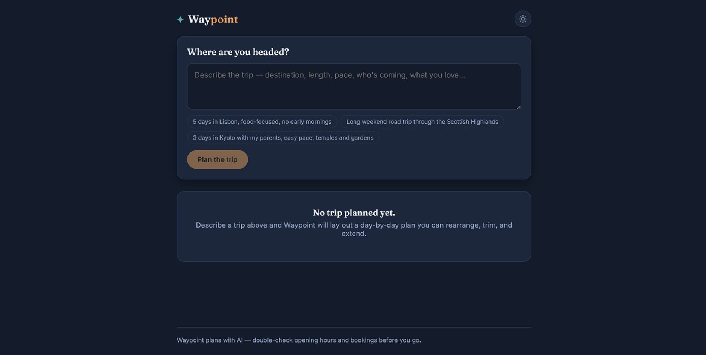

# Waypoint – AI Trip Planner

Waypoint is an AI-powered Trip Planner that converts natural language travel requests into structured, interactive day-by-day itineraries using Google's Gemini API.

Instead of displaying raw AI responses, the application parses structured JSON and renders an interactive itinerary where users can expand days, reorder stops, remove destinations, and add custom stops.

---

## Features

- AI-powered trip itinerary generation
- Interactive day-by-day itinerary
- Expand and collapse trip days
- Reorder stops within a day
- Remove unwanted stops
- Add custom stops
- Loading, empty, and error states
- Backend validation of AI responses
- Secure API key handling using an Express backend

---

## Tech Stack

### Frontend
- React
- Vite
- JavaScript
- CSS

### Backend
- Node.js
- Express.js

### AI
- Google Gemini API
- @google/genai SDK

---

## Project Structure

```
trip-planner/
│
├── frontend/
├── backend/
├── README.md
└── package.json
```

---

## Setup

Clone the repository:

```bash
git clone https://github.com/KhushiYadav0624/trip-planner.git
cd trip-planner
```

Install backend dependencies:

```bash
cd backend
npm install
```

Install frontend dependencies:

```bash
cd ../frontend
npm install
```

---

## Environment Variables

Create a `.env` file inside the `backend` folder.

```env
GEMINI_API_KEY=YOUR_GEMINI_API_KEY
PORT=8787
```

---

## Running the Project

Start the backend:

```bash
cd backend
npm start
```

Start the frontend:

```bash
cd frontend
npm run dev
```

Open:

```
http://localhost:5173
```

---

## Usage

1. Enter a travel request in the input field.
2. Click **Generate Trip**.
3. Wait for the AI to generate an itinerary.
4. Expand or collapse trip days.
5. Reorder stops.
6. Remove unwanted stops.
7. Add custom stops.

---

## AI Usage Note

This project uses Google's Gemini API through the official `@google/genai` SDK to generate structured JSON itineraries.

ChatGPT was used as a development assistant for brainstorming, debugging, understanding API errors, and improving documentation. All implementation, integration, testing, and final verification of the project were completed and understood by me.

---

## Handling AI Failures

The application gracefully handles:

- Empty prompts
- Invalid or malformed JSON
- Missing required fields
- Unexpected AI response structure
- API failures
- Rate limiting
- Temporary service unavailability

Instead of crashing, meaningful error messages are displayed to the user.

---

## Known Limitations

- Requires an internet connection.
- AI-generated travel plans may occasionally contain inaccurate information.
- User authentication is not implemented.
- Itineraries are not stored in a cloud database.

---

## Time Spent

Approximately **8 hours**, including:

- Project planning
- Frontend development
- Backend API integration
- Gemini AI integration
- Testing and debugging
- Documentation

---

## Screenshots

### Home Page



### Generated Trip


---

## Future Improvements

- User authentication
- Save itineraries to the cloud
- Google Maps integration
- Weather information
- Hotel recommendations
- Budget estimation
- PDF export

---

## Author

**Khushi Yadav**
